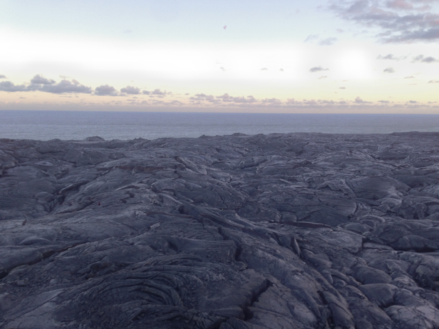

If I believed in astrology, 2016 would've been my [Saturn return](https://en.wikipedia.org/wiki/Saturn_return).  Without going into too much detail,

* I quit graduate school and moved to Oakland,
* Tried working at a start up, burned out and quit,
* Separated from my long term partner,
* Drove across the United States to Coney Island,
* Learned how to do a hand stand (kind of),
* Started a [worker owned cooperative](https://bits.coop),
* Moved to Hawaii.

I'm now living off grid on an active lava flow by the pacific ocean:

I wouldn't have made it through this without an enormous amount of support from my friends.  And while it wasn't easy, life finally feels like it is settling down a bit.

I want to get back into blogging and toward this end I'm starting a new website, [0hz.life](https://0hz.life).  All the things I've previously written at 0fps will remain online and the URLS will stay intact but I'm going to post my new stuff here.  

Part of the reason for starting a new site is that I want to get out of wordpress and start using less centralized systems, like IPFS or dat.  Decentralized technology is healthier for society and also works better offline (which happens frequently out here).  We'll see how it goes.
