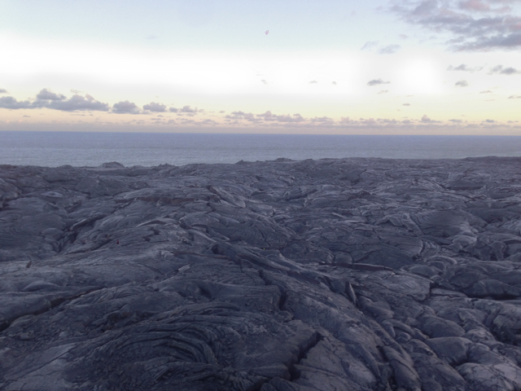

If I believed in astrology, 2016 would've been the year of my [Saturn return](https://en.wikipedia.org/wiki/Saturn_return).  It was a time of great personal growth and adventure.  Without going into too much detail,

* I quit graduate school and moved to Oakland,
* Tried working at a start up, burned out and quit,
* Separated from my long term partner,
* Drove across the United States to Coney Island,
* Learned how to do a hand stand (kind of),
* Started a [worker owned cooperative](https://bits.coop),
* Moved to Hawaii.

I'm now living off grid on an active lava flow by the pacific ocean:

I don't think I would've made it through this without an enormous amount of support and patience from my friends.  While it wasn't easy, life finally feels like it is settling down a bit.  

I'm going to try to get back into blogging and toward this end I'm starting a new website, [0hz.life](https://0hz.life).  All the things I've previously written at 0fps will remain online and the URLS will stay intact but I'm going to post my new stuff here.  

Part of the reason for starting a new site is that I want to get out of wordpress.  I would rather store my writing in plain files, not some cumbersome content management system's database.  This makes it easier to work offline (which happens frequently out here), but more importantly also paves the way for eventually hosting all my content on a decentralized data store like IPFS or dat.

Also I want to break out of the oppressive perfectionism and procrastination which was holding me back.  Maybe by starting this new thing I can keep the bar low enough and the content small enough that I can stay focused and produce consistent updates.  To do this I'm going to experiment with linking to content that isn't just writing but also includes small technical demos or modules that I've written over time.  We'll see how it goes.
